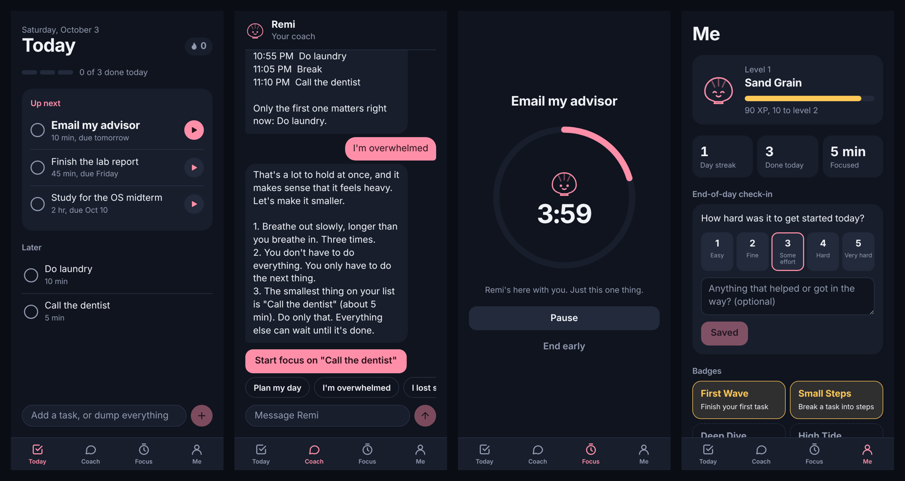

# Remi

**A pocket-sized AI coach that turns ADHD overwhelm into one small next step.**

ADHD makes three things hard: getting started, holding a plan in mind, and
staying level when everything piles up. Most task apps hand you a long list
and wait for you to open them. Remi keeps the next three things in front of
you, talks you through the moments you get stuck, and makes finishing feel
like progress.



## What it does

**Today.** Your next three tasks, ranked for you, with the first one given the
most weight. Type one task or dump everything on your mind into the box and
Remi sorts it into tasks with due dates, time estimates, and effort levels.

**Coach.** A chat with Remi built around three prompts:

- *Plan my day* lays your tasks into a time-blocked schedule for the next few
  hours, with breaks built in.
- *I'm overwhelmed* slows things down and points at the single smallest task.
- *I lost something* walks through a calm, ordered search.

When Remi points at a task, one tap starts a focus timer on it.

**Focus.** A countdown ring with Remi keeping you company, a simple form of
body doubling. The timer keeps running if you switch tabs.

**Me.** Levels, XP, a day streak, and badges, plus an end-of-day check-in that
asks one question: how hard was it to get started today?

**Task details.** Tap any task to see why it's ranked where it is, break it
into small steps, or say "not now", which moves it aside for two hours
without guilt.

## How it works

### Prioritization

Ranking is a sum of small, explainable signals rather than a black box
(`backend/app/services/prioritize.py`): deadlines, importance, quick wins,
age, and whether a task was just skipped. Every signal that fires adds a
plain-language reason, shown in the task's details. A task skipped three
times gets a suggestion to break it down, since it is probably too big or too
vague.

### AI with a fallback

Remi uses Gemini in two places, and each has a rule-based twin behind the
same interface:

| Job | With a Gemini key | Without one, or if the call fails |
|-----|-------------------|-----------------------------------|
| Turn a brain dump into tasks | Structured JSON output, validated and clamped field by field | Rules that parse due dates, durations, urgency, and effort |
| Coach replies | A prompt tuned for ADHD coaching, given the user's ranked tasks and recent messages | Fixed scripts based on CBT techniques for ADHD |

This means the app runs, and the whole test suite passes, with no API key and
no network. The day plan itself is always built by code
(`backend/app/services/schedule.py`), so the model presents a schedule but
never invents times.

### Gamification

Finishing things earns XP, harder tasks earn more, and focus time and
check-ins count too (`backend/app/services/gamify.py`). Levels are named
after bigger and bigger shells, from Sand Grain to Nautilus. The rules are
deliberately gentle: a streak survives until the end of the next day, and
nothing is taken away for a bad one.

## Tech stack

| Layer    | Tools |
|----------|-------|
| Frontend | React 19, TypeScript, Vite |
| Backend  | Python, FastAPI, SQLModel, Pydantic |
| Database | PostgreSQL (SQLite for zero-setup local development) |
| AI       | Gemini API |
| Testing  | pytest (87 tests), GitHub Actions |

## Running locally

You need Python 3.11+ and Node 18+.

### Backend

```bash
cd backend
python -m venv venv
source venv/bin/activate          # Windows: venv\Scripts\activate
pip install -r requirements-dev.txt
uvicorn app.main:app --reload     # http://localhost:8000
```

This uses a local SQLite file and the rule-based planner and coach, so there
is nothing else to set up. Interactive API docs are at
`http://localhost:8000/docs`.

To use PostgreSQL or Gemini, copy `backend/.env.example` to `backend/.env`
and fill it in. `docker compose up -d` starts a local PostgreSQL.

### Frontend

```bash
cd frontend
npm install
npm run dev                       # http://localhost:5173
```

The app is designed for a phone. On a computer it shows in a phone-width
frame.

### Tests

```bash
cd backend
pytest
```

## API

| Endpoint | Description |
|----------|-------------|
| `POST /api/brain-dump` | Turn free-form text into saved tasks |
| `GET /api/tasks` | Open tasks ranked by priority |
| `POST /api/tasks/{id}/complete` | Mark done and award XP |
| `POST /api/tasks/{id}/skip` | Not now |
| `POST /api/tasks/{id}/breakdown` | Split into small steps |
| `POST /api/coach` | Send Remi a message and get a reply |
| `GET /api/plan` | Time-blocked plan for the next few hours |
| `POST /api/focus` | Record a finished focus session |
| `POST /api/reflections` | Save the end-of-day check-in |
| `GET /api/profile` | XP, level, streak, daily goal, and badges |

The full list, with request and response shapes, is in the interactive docs.

## Project structure

```
backend/
  app/
    main.py                  FastAPI app
    models.py                Database tables
    routers/                 tasks, coach, and progress endpoints
    services/prioritize.py   Ranking engine
    services/planner.py      Brain dump to tasks (Gemini and rules)
    services/coach.py        Coach replies (Gemini and scripts)
    services/schedule.py     Day plan builder
    services/gamify.py       XP, levels, streaks, badges
  tests/                     pytest suite
frontend/
  src/
    App.tsx                  Tabs, shared state, XP toasts
    screens/                 Today, Coach, Focus, Me
    components/              Tab bar, task row, task sheet, mascot
mobile/                      Early Expo app shell for a future native client
```

## Roadmap

The product vision is an iOS app. This web version covers the core loop; the
pieces that need a native app or outside services come next:

- Lock-screen widget showing the next three tasks (iOS Live Activities)
- Opt-in phone-call reminders for critical tasks that get ignored
- Voice capture for adding tasks
- Accounts and sign-in (Remi is single-user today)
- Use check-in history to adjust time estimates and rankings per user

## Credits

Built by [Afaf Maliha](https://github.com/afafMaliha0716). Thanks to Saurav
Kandel for the early mobile app shell and database setup.
